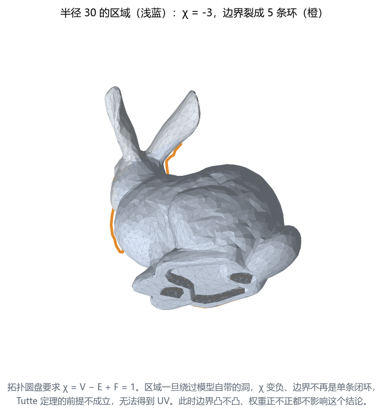
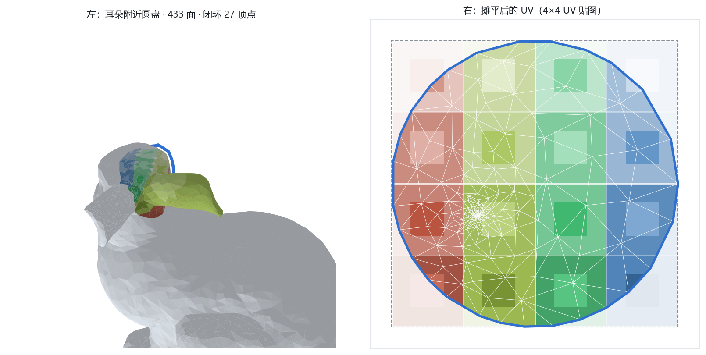
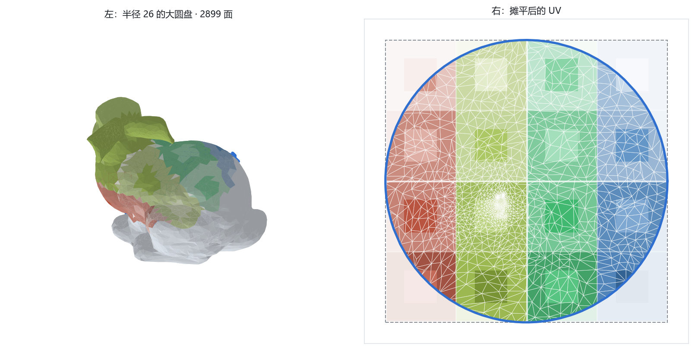
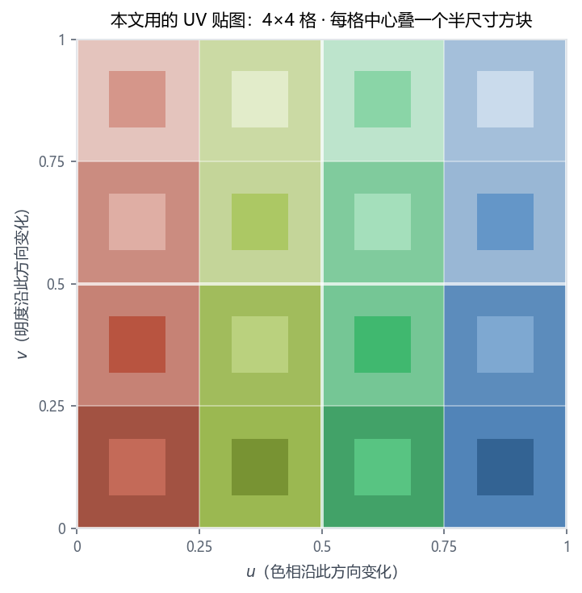
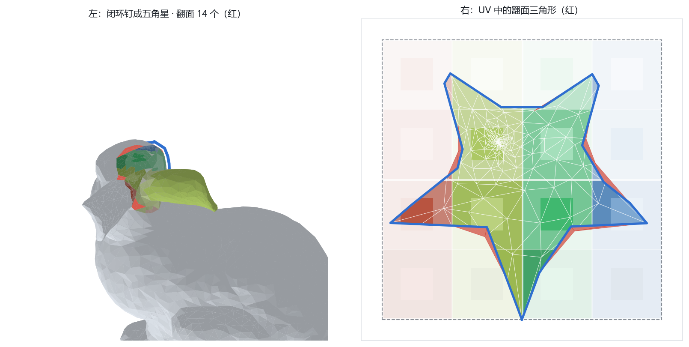
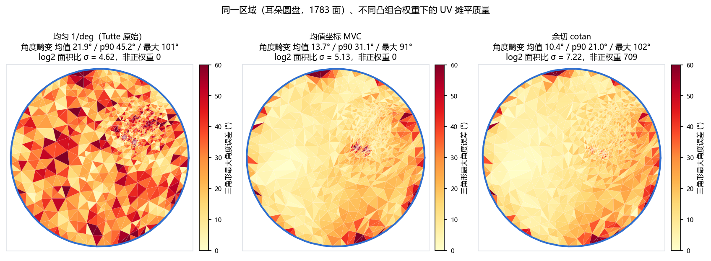
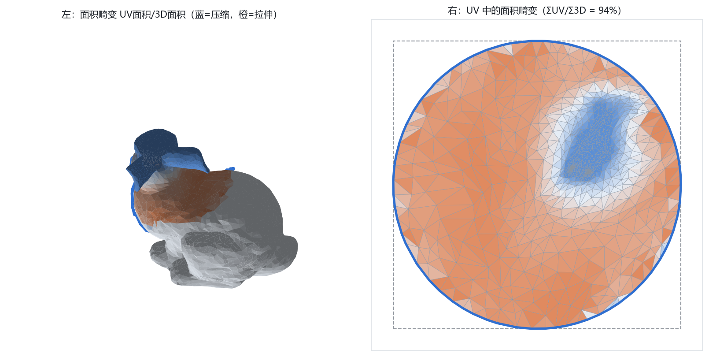

# 在 Stanford Bunny 上跑 Tutte 嵌入：取闭环、验证圆盘、摊平、贴图

前面两个演示用的都是自己生成的参数曲面，几何干净、拓扑已知。这一篇换成真实扫描模型 Stanford Bunny，把整条流程跑一遍：在曲面上取一条闭环，检查闭环内部是不是拓扑圆盘，解 Tutte 嵌入得到 UV，再把贴图贴回曲面。

结论先放这里：**能跑通的部分和定理说的一样，跑不通的部分也和定理说的一样。**几何上的难点集中在"闭环内部到底是不是圆盘"这一步，兔子上有 4 个洞，半径稍大一点就绕过去了。

所有数字来自 `render-bunny-figs.py`（离线渲染）与 `bunny-tutte.html`（交互页面）两条独立实现，两边结果逐项一致。

---

## 一、模型与它的拓扑

两个文件都下的同一个模型，来源是公开数据集：

| 文件 | 顶点 | 三角面 | 说明 |
|---|---|---|---|
| `model/bunny_small.obj` | 2503 | 4968 | 演示用（[Fisher 的 Stanford 数据集镜像](https://graphics.stanford.edu/~mdfisher/Data/Meshes/bunny.obj)） |
| `model/stanford-bunny.obj` | 35947 | 69451 | 原始扫描精度（[common-3d-test-models](https://raw.githubusercontent.com/alecjacobson/common-3d-test-models/master/data/stanford-bunny.obj)） |

先跑一遍拓扑体检：

| 指标 | 数值 |
|---|---|
| 唯一边数 | 7473 |
| 边界边（只属于 1 个面） | 42 |
| 内部边（属于 2 个面） | 7431 |
| 非流形边（属于 >2 个面） | 0 |
| 连通分量 | 1 |
| 欧拉特征 $\chi = V - E + F$ | $-2$ |
| 洞的数量 | 4 |

$\chi = 2 - 2g - b$，代入 $\chi = -2$ 得 $2g + b = 4$。实际数出来 $b = 4$、$g = 0$：兔子是**带 4 个洞的开曲面**，不是闭曲面。洞在底部，扫描时固定用的底座留下的。

这一条直接决定了后面能做什么：闭环内部必须是拓扑圆盘（$\chi = 1$、单条边界环），兔子身上的洞一旦被圈进来就做不到。

顺带验了绕向：14904 条有向边每条恰好出现一次，7431 对相邻面里只有 4 对法线反向（是极窄的折叠，不是绕向错误）。绕向全局一致，可以直接拿来当翻面判据用。

---

## 二、在曲面上取一条闭环

### 做法

从种子点按 BFS 跳数扩张出一个顶点集合，再从中提取闭环：

1. **区域**：从种子点做 BFS，取跳数 $\le h$ 的所有顶点；
2. **内部三角面**：三个顶点都在区域内的三角面；
3. **边界半边**：对每个内部三角面，看它三条有向边 $a \to b$。如果反向边 $b \to a$ 不属于任何内部三角面，那么 $a \to b$ 就是一条边界半边；
4. **串环**：边界半边首尾相接。每个边界顶点应该有且只有一条出边，串起来就是闭环。

### 判定是不是拓扑圆盘

两条硬指标，缺一不可：

- $\chi = V_{\text{in}} - E_{\text{in}} + F_{\text{in}} = 1$
- 边界半边恰好串成 **1 条**简单闭环

只要区域绕过了模型自带的洞或者把手，$\chi$ 就会掉到 0 或负数，边界也会裂成好几条环。这不是数值问题，是拓扑事实。

### 实测结果

种子取四个特征点（耳朵尖 = y 最大、鼻子 = x 最大、尾巴 = x 最小、背部 = z 最大、腹部 = y 最小），每个种子扫一遍半径：

| 种子 | h=6 | h=10 | h=14 | h=18 | h=22 | h=26 | h=30 |
|---|---|---|---|---|---|---|---|
| 耳朵尖 | ✓ 211面 | ✓ 433面 | ✗ χ=0 | ✗ χ=0 | ✗ χ=0 | ✓ 2899面 | ✓ 3751面 |
| 鼻子 | ✓ 218面 | ✓ 523面 | ✗ χ=0 | ✗ χ=−3 | ✗ χ=−3 | ✗ | ✗ χ=−3 |
| 尾巴 | ✓ 261面 | ✓ 723面 | ✗ χ=0 | ✗ χ=0 | ✓ 3288面 | ✗ χ=0 | ✗ χ=−3 |
| 背部 | ✓ 229面 | ✓ 621面 | ✓ 1169面 | ✗ χ=0 | ✗ | ✗ | ✗ |
| 腹部 | ✗ χ=0 | ✗ χ=−2 | ✗ χ=−3 | ✗ χ=−4 | ✗ χ=−4 | ✗ | ✗ χ=−4 |

（面数 = 区域内的三角面数，χ 为不合法的情形）

几处值得记的现象：

- **合法的半径不连续。**耳朵尖在 h=10 合法、h=14 到 h=22 全不合法、h=26 又合法。中间那一段是区域"骑"到了洞上面，$\chi$ 掉到 0；再大之后洞口被完全包含进区域内部，边界重新合成一条。
- **腹部全程无解。**种子点紧贴洞的边缘，任何半径都会把洞圈进来。
- **可用的区域大小跨度很大。**从 211 面到 3751 面都有合法解，大区域反而 $\chi$ 更稳。

### 不合格时发生了什么



半径 30 时区域（浅蓝）把底部几个洞裹了进来，$\chi = -3$，边界裂成 5 条互相独立的环（橙）。图里能看到环形贴着模型自带的洞口走。此时 Tutte 定理的前提不成立，UV 解不出来——跟边界凸不凸、权重正不正没有关系，那些是前提成立之后才谈的事。

---

## 三、解 Tutte 嵌入

前提满足时，问题变成一个线性系统。内部顶点的 UV 是邻居 UV 的凸组合：

$$\mathbf{u}_i = \sum_{j \in N(i)} w_{ij}\,\mathbf{u}_j, \qquad w_{ij} > 0, \qquad \sum_{j \in N(i)} w_{ij} = 1$$

边界顶点按闭环在 3D 上的**弧长比例**钉到目标形状上（避免边界处额外拉伸），内部的 $u$、$v$ 各解一个稀疏线性系统：

$$L_W \mathbf{x} = \mathbf{b}_x, \qquad L_W \mathbf{y} = \mathbf{b}_y, \qquad L_W = I - W$$

- 交互页面用 Gauss–Seidel 松弛，迭代 400–600 次收敛（判据：单次最大位移 < 1e-8）
- 离线脚本用 `scipy.sparse.linalg.spsolve` 直接解

三种权重都实现了：均匀 $1/\deg(i)$、余切 $\cot\alpha + \cot\beta$、均值坐标 $(\tan(\delta/2) + \tan(\gamma/2)) / \|x_i - x_j\|$。

### 结果



耳朵附近取半径 10 的闭环，区域 231 顶点 / 663 边 / 433 面，$\chi = 1$，闭环 27 个顶点。摊平后 **0 个翻面**，与定理的预期一致。



半径 26 的大区域：1496 顶点 / 4394 边 / 2899 面，闭环 91 个顶点，同样 0 翻面。区域大了 6.7 倍，角度畸变的均值从 13.38° 降到 9.46°，也更稳定。

### 贴图



左图表面上贴的是一张 UV checker：$4 \times 4$ 格，沿 $u$ 走色相（红→黄→绿→蓝）、沿 $v$ 走明度，每格中心再叠一个半尺寸的小方块。格子边界用白色细线，每隔两格加粗，方便直接读出 UV 的拉伸和旋转。右图同一张贴图落在 UV 平面上，圆盘内的部分是实际用到的区域，圆盘外淡显作上下文。

两条实现的纹理路径不同：页面用 canvas 的仿射变换逐三角形贴图（逐像素采样），离线脚本对每个三角形按 UV 跨度自适应细分，再逐子三角形取重心处的颜色。`check-tex-parity.py` 把两个页面里贴图生成函数的真实源码单独光栅化，再与离线版逐通道比对：`bunny-tutte.html` 的 $512^2 \times 3 = 786432$ 个通道、定理页的 $256^2 \times 3 = 196608$ 个通道，排除网格线取整造成的 1 px 边界后最大差都是 0。定理页那张用的是同一套图案平铺（16 格 / 图案周期 4），单位圆内正好落一个完整图案，格底色采样比对后最大差 0。

---

## 四、把前提破坏掉

### 边界换成非凸形状



同一个闭环（耳朵，433 面），只把目标边界从圆换成五角星：**14 个三角形翻面**。右图里红色的部分全部集中在五角星的凹角附近——那里不再是凸的，定理的证明链在这个位置断掉。

换成 L 形：7 个翻面。数量比五角星少，因为 L 形的凹角只有一个。

顺带一个对照：五角星边界的总面积比只有 178.3%，圆形边界是 397.3%。ΣUV 由边界多边形的面积决定，五角星比单位圆小得多。

### 权重换成余切

余切权重在钝角三角形上会变负。耳朵半径 20 的区域（1783 面）上统计：

| 权重 | 非正权重条数 | 翻面 | 角度畸变均值 | p90 | 最大 |
|---|---|---|---|---|---|
| 均匀 $1/\deg$ | 0 | 0 | 21.86° | 45.24° | 101° |
| 均值坐标 MVC | 0 | 0 | 13.66° | 31.09° | 91° |
| 余切 cotan | **709** | 0 | 10.36° | 21.02° | 102° |

余切权重那行有两个信息：

1. 709 条边的权重非正，**凸组合条件确实被破坏了**；
2. 但这一例里**一个翻面都没有**。

这说明定理的前提是充分条件。前提不成立时保不住单射，不成立也不必立刻出事，结果取决于具体网格——兔子这个区域恰好扛住了。工程上不能靠这个，余切权重在畸变上确实最好（角度畸变均值 10.36° 对 MVC 的 13.66°），所以主流做法是把它当优化目标、用别的手段兜底合法性。



---

## 五、定理不管的那部分：畸变

定理只保证单射，畸变完全不承诺。三种指标看下来：

| 配置 | 面数 | 翻面 | 角度畸变均值 / p90 | $\log_2$ 面积比 p25 / 中位 / p75 / σ |
|---|---|---|---|---|
| 耳朵 h=10，圆，MVC | 433 | 0 | 13.38° / 28.17° | −7.93 / −4.08 / 1.05 / 4.61 |
| 耳朵 h=20，圆，MVC | 1783 | 0 | 13.66° / 31.09° | −7.47 / −1.61 / 0.95 / 5.13 |
| 耳朵 h=26，圆，MVC | 2899 | 0 | 9.46° / 22.67° | −5.21 / −0.87 / 0.89 / 5.36 |
| 耳朵 h=10，五角星，MVC | 433 | 14 | 18.19° / 37.70° | −7.75 / −3.95 / 0.27 / 4.48 |



几个观察：

- **面积畸变的尾部很重。**中位数是 $-4.08$（约 16 倍压缩），四分位距跨了 9 个 $\log_2$ 单位。少数三角形吃掉大量 UV 面积，多数被压到很小。这是固定边界的典型形态。
- **区域越大，畸变越小。**耳朵小圆盘（433 面）钉到整个单位圆上，放大倍数很高；大圆盘（2899 面）范围接近模型本身，反而更均匀。
- **$ΣUV / Σ3D$ 这个量对尺度敏感。**UV 面积被边界多边形锁死（单位圆就是 $\pi$），3D 面积取决于模型怎么归一化。所以表里真正有意义的判据是 $\log_2$ 比值的分布宽度（σ）和角度畸变，总面积比只能同模型横向比较。

---

## 六、这次踩到的坑

**1. CSR 邻接表的尺寸算错。** 一个三角面给每个顶点贡献 2 个邻居条目，但每条边被两个面共享，所以按面直接展开会让每个邻居出现两次，条目总数是 $2 \times \sum \deg$，不是 $\sum \deg$。按 $\sum \deg$ 分配数组会导致写入被静默丢弃，邻接表变成垃圾——表现是 BFS 区域看起来正常，但提取边界时 $\chi = -22$、边界裂成 31 条环。先过一遍 Set 去重再打包最稳。

**2. 边到面的映射排序分块不一致（Python 版）。** 我按"先所有 $ab$ 边、再 $bc$、再 $ca$"的顺序拼接边键，而面号却按"每个面三条"重复。两套顺序错位后，映射表整体偏移，任何一条边查出来的相邻面都不包含自己。改用同样分块的 `concatenate([arange(NT)] * 3)` 后，结果与 node 版逐位一致。

**3. mplot3d 的"上"是 z 轴。** 兔子模型以 y 为高度，直接丢进 `Poly3DCollection` 会躺平。绘制前把坐标置换 $(x, y, z) \to (x, z, y)$。

**4. 闭环被网格面挡住。** mplot3d 用 artist 级深度排序，线框会沉到面下面。按顶点法线把闭环外推 0.022 个单位后可见。

**5. 指标本身有尺度依赖。** 一开始用 $\Sigma UV / \Sigma 3D$，Python 版算出 397.3%、JS 版算出 568.3%，差异全部来自归一化方式（bbox 中心 vs 顶点质心）。统一成 bbox 中心 + 最大半边长之后两边一致。这个量的绝对值只在同一归一化下可比。

**6. Gauss–Seidel 的收敛判据要留够余量。** 大区域（4148 面）在 600 帧后还剩 2 个翻面，多跑一会儿归零。判据用"单次最大位移 < 1e-8"而不是固定迭代次数。

**7. 3D 侧的纹理采样要跟着格子密度调。** 一开始对每个三角形只取一次重心颜色，当三角形在 UV 空间里比一个格子还小时，相邻三角形会随机落进不同格子，整片表面变成椒盐噪点。改成按 UV 跨度自适应细分（跨度超过约 1/4 格就拆成 $k^2$ 个小三角形）之后过渡恢复正常。格子密度也要试：$8 \times 8$ 摊到耳朵这种小区域上，每个三角形只覆盖格子的三分之一，看起来就是一坨糊；换成 $4 \times 4$ 才读得出格子。同一张贴图在 2899 面的大区域上反而清晰，因为那里的三角形更小、UV 分布更均匀。

---

## 七、文件与复现

| 文件 | 作用 |
|---|---|
| `bunny-tutte.html` | 交互页面：切闭环、调半径/形状/权重、看摊平结果。需通过 http 打开 |
| `render-bunny-figs.py` | 离线出图脚本，同时打印全部量化指标 |
| `model/bunny_small.obj` | 演示用模型（4968 面） |
| `model/stanford-bunny.obj` | 原始精度（69451 面） |
| `figs/*.png` | 本文的 7 张图 |
| `check-bunny-page.js` | 页面 JS 与离线脚本的数字交叉验算 |
| `check-tex-parity.py` + `check-tex-raster.js` | 页面贴图与离线贴图逐像素比对 |
| `check-html-syntax.js` | 三个页面的内联 script 编译检查（无浏览器环境下用） |
| `check-blog-style.py` | 本文交付前校验（禁用句式、公式配对、图片引用） |

交互页面需要本地服务（`fetch` 在 `file://` 下会被拦截）：

```bash
python -m http.server 8765
# 打开 http://127.0.0.1:8765/bunny-tutte.html
```

页面支持 URL 参数固定状态，便于复现和分享：

```
?seed=ear&hop=10&shape=circle&weight=mvc&view=tex&fb=1&yaw=0.6&pitch=0.25&zoom=1
```

离线出图（用本机装了 numpy/scipy/matplotlib 的解释器）：

```bash
C:/Users/liste/miniconda3/envs/python3.11/python.exe render-bunny-figs.py
```

两条实现相互独立：JS 版自己写解析、BFS、权重与 Gauss–Seidel，Python 版用 numpy 向量化 + scipy 直接解。同参数下区域顶点数、面数、$\chi$、闭环长度、翻面数、面积比全部一致。

---

## 参考

- W. T. Tutte, *How to draw a graph*, Proc. London Math. Soc. 13(3):743–767, 1963.
- M. S. Floater, *Mean value coordinates*, CAGD 20(1):19–27, 2003.
- M. S. Floater, K. Hormann, *Surface parameterization: a tutorial and survey*, 2005.
- Stanford 3D Scanning Repository / Stanford Bunny 模型。
- CGAL, *Planar Parameterization of Triangulated Surface Meshes*（各参数化方法的 bijectivity 条件）。
