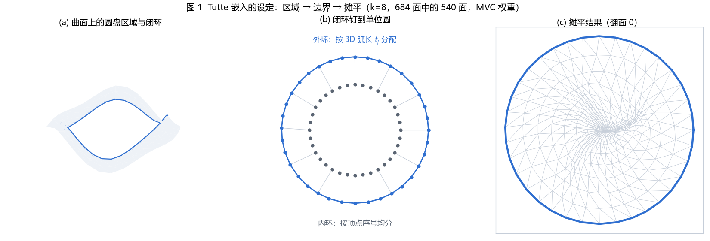
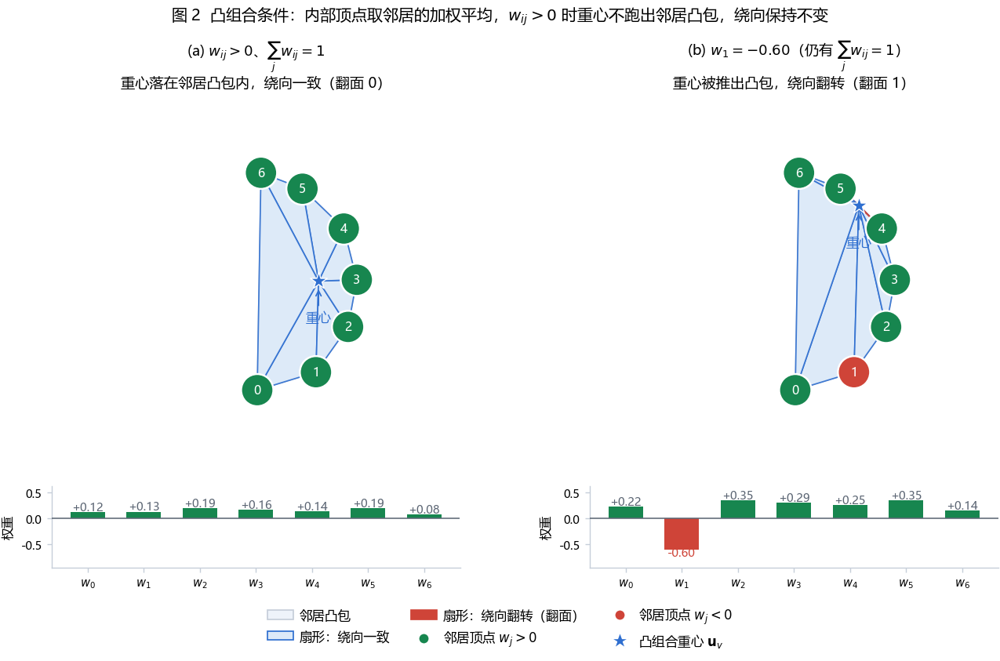
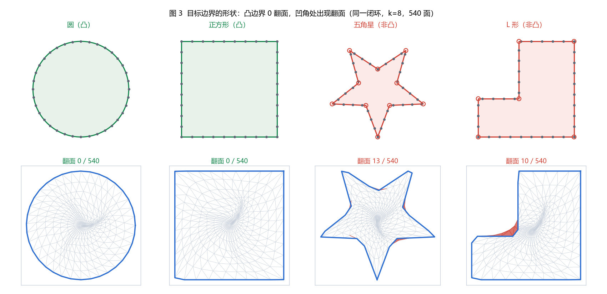
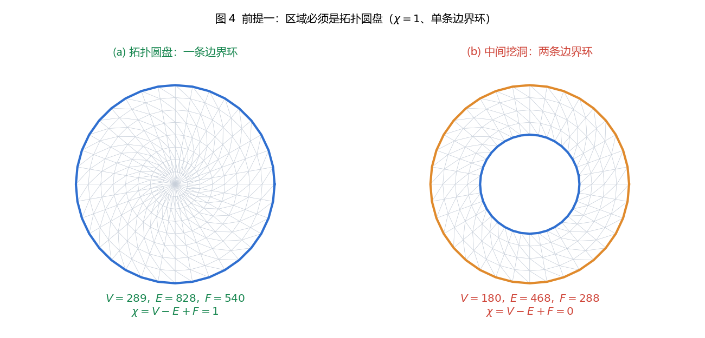

# Tutte 嵌入定理：凸组合权重为什么能保证摊平不翻面

[在线演示 → listenzcc.github.io/tutte-theorem-1](https://listenzcc.github.io/tutte-theorem-1/)

把一块三角网格曲面摊成平面（也就是求 UV 参数化），最基础的一条要求是**不能有三角形翻面**。翻面意味着映射在局部改变了定向，贴上去的图会打褶。Tutte 在 1963 年的 *How to draw a graph* 里给了一个构造性条件：只要边界钉在凸多边形上、内部顶点用**正的**凸组合权重去解，得到的分片线性映射一定全局单射。

本文写定理本身：条件的来由、证明骨架、三种常见权重各自的正值性、以及定理不做承诺的那部分。

---

## 一、问题设定

设 $M$ 是一张三角剖分的**拓扑圆盘**：顶点集 $V$、内部顶点集 $I$、边界顶点沿 $\partial M$ 排成一个闭环。分片线性映射 $f : M \to \mathbb{R}^2$ 完全由顶点的 UV 决定，在每个三角形上取重心坐标插值。

单个三角形 $(a,b,c)$ 在 UV 平面的有向面积

$$A_{uv}(a,b,c) = \frac{1}{2}\Big[(u_b-u_a)(v_c-v_a) - (u_c-u_a)(v_b-v_a)\Big]$$

要求全部三角形的有向面积同号（与 3D 上的绕向一致），这是"局部没有翻面"。局部都不翻仍然不够，两个相距很远的面片可能在 UV 上叠到一起。完整的要求是 $f$ **全局单射**。

Tutte 定理给了一个可以直接检查的充分条件。

上图是整条流程：取第 8 圈作为闭环，区域 540 面、边界 36 个顶点；(b) 里外环是按 3D 弧长 $t_j$ 分配的位置（疏密不均），内环是按顶点序号均分的位置（均匀），两者对比可以看出弧长参数化的效果；(c) 是解出的 UV，翻面 0。

---

## 二、定理表述

**定理（Tutte, 1963）。** 设 $M$ 是拓扑圆盘的三角剖分，$f$ 是分片线性映射。若

1. **边界条件**：$f$ 把 $\partial M$ 的顶点按闭环顺序映到某个**凸**多边形 $\Omega$ 的边界上，且边界映射是同胚（相邻边界顶点的像不重合、顺序不变）；
2. **内部条件**：每个内部顶点 $i \in I$ 满足严格凸组合方程

$$\mathbf{u}_i = \sum_{j \in N(i)} w_{ij}\,\mathbf{u}_j, \qquad w_{ij} > 0, \qquad \sum_{j \in N(i)} w_{ij} = 1$$

则 $f$ 是单射，$f(M) = \Omega$。

条件 2 是离散 Laplace 方程 $L_W \mathbf{x} = 0$（带 Dirichlet 边界条件），$L_W = I - W$。$\mathbf{u}$ 的两个坐标各解一个线性系统：

$$L_W \mathbf{x} = \mathbf{b}_x, \qquad L_W \mathbf{y} = \mathbf{b}_y$$

$\mathbf{b}$ 由边界顶点的目标位置移过来。$L_W$ 严格对角占优（对角为 1，每行非对角元绝对值之和为 1，且至少有一条边界邻居使和严格小于 1），所以系统非奇异，解唯一。

---

## 三、证明骨架

严格证明要用到平面拓扑的环绕数论证，这里写四步骨架。

### 第一步：像不跑出凸包

条件 2 对每个坐标分量都成立，于是内部顶点的取值落在邻居取值的最小值与最大值之间。这就是离散极值原理：离散调和函数在有界区域上的极值只能在边界取到。

对 $x$、$y$ 两个分量分别用一次，得到

$$f(M) \subseteq \operatorname{conv}\big(f(\partial M)\big) = \Omega$$

内部顶点不会跑到边界多边形外面去。这一步只用到"凸组合"，权重为正不是必需的（非负即可）。

### 第二步：星形邻域内局部单射

对内点 $v$，把它的邻居按绕 $v$ 的角度顺序记为 $j_1, \dots, j_k$。因为 $\mathbf{u}_v$ 是这些邻居的严格凸组合，$\mathbf{u}_v$ 落在邻居构成的凸包的**内部**，于是绕 $v$ 的 $k$ 个三角形在 UV 上都保持与 3D 一致的绕向，且它们只在公共边上相交。

这一步必须要求 $w_{ij} > 0$。某个权重为 0 时 $\mathbf{u}_v$ 可能落在邻居凸包的边界上；为负时可能直接跑出去，绕向就可能反。

上图是一个 7 邻居的星形邻域，两种权重的取值都满足 $\sum_j w_{ij} = 1$，每列下方的条形图给出这 7 个权重的具体数值。左图重心在凸包内，7 个三角形绕向一致；右图把 $w_1$ 改成 $-0.60$（其余按原比例放大以保持和为 1），重心被推出凸包，有 2 个三角形的绕向翻转（红）。

### 第三步：边界上是同胚

这是条件 1 直接给的，不需要推导。闭环按弧长比例分配到凸多边形边界上，顺序保持，得到的边界映射就是同胚。

### 第四步：从局部单射到全局单射

对点 $y \in \Omega \setminus f(\text{网格的边})$，定义映射度 $\deg(f, y) = \sum_{x \in f^{-1}(y)} \operatorname{sign}\det Df(x)$。三个事实：

- $\deg(f, y)$ 在 $\Omega$ 内部关于 $y$ 是局部常数，而 $\Omega$ 连通，所以在整个 $\Omega$ 上为常数；
- 取 $y$ 靠近 $\partial\Omega$，由边界同胚可知 $\deg(f, y) = 1$；
- 由第二步的局部单射，每点处 $\det Df > 0$，所以每个 $y$ 的原像个数等于 $\deg(f, y)$。

于是 $\Omega$ 内每点的原像恰好一个，$f$ 是双射，映满 $\Omega$。

---

## 四、权重从哪来

条件 2 只要求权重正、行和为 1。满足这个条件的取法很多，常见三种：

| 权重 | 定义 | 正值性 | 出处 |
|---|---|---|---|
| 均匀 | $w_{ij} = 1/\deg(i)$ | 恒正 | Tutte 原始构造 |
| 余切 | $w_{ij} = \dfrac{\cot\alpha_{ij} + \cot\beta_{ij}}{\sum_k(\cot\alpha_{ik}+\cot\beta_{ik})}$ | 钝角三角形上 $\cot\alpha + \cot\beta < 0$ | 离散共形映射 |
| 均值坐标 MVC | $w_{ij} = \dfrac{\big(\tan(\delta_{ij}/2) + \tan(\gamma_{ij}/2)\big)/\|x_i - x_j\|}{\sum_k \cdots}$ | 星形多边形内恒正 | Floater 1997 / 2003 |

$\alpha_{ij}$、$\beta_{ij}$ 是边 $ij$ 在两个相邻三角形上的对角；$\delta_{ij}$、$\gamma_{ij}$ 是这两个三角形中顶点 $i$ 处的内角。余切权重那一行分子可能为负，实现里通常统计非正权重的条数作为前提是否成立的指标。

三种权重的来头不同：

- **均匀权重**对应组合 Laplacian（umbrella operator）。它把网格当图看，忽略边长和角度，收敛性上对不规则网格不逼近连续调和函数，但正值性无条件成立。
- **余切权重**来自 Dirichlet 能量的离散化：

$$E(u) = \frac{1}{2}\sum_{(i,j) \in E} \big(\cot\alpha_{ij} + \cot\beta_{ij}\big)\,\|\mathbf{u}_i - \mathbf{u}_j\|^2$$

对 $\mathbf{u}_i$ 求偏导令其为零，得到的正是余切形式的离散 Laplace 方程。它是三种里畸变最小的（实测角度畸变均值 10.36°，MVC 13.66°，均匀 21.86°），代价是钝角三角形上权重变负。
- **均值坐标**是重心坐标在星形多边形上的推广，Floater 证明了它在星形域内恒正。它兼顾了几何信息和正值性，是 Tutte 嵌入在实践里的默认选择。

---

## 五、边界怎么钉

边界顶点的目标位置要按闭环在 3D 上的**弧长比例**分配目标周长，而不是按顶点序号均分：

$$t_j = \frac{\sum_{k<j} \|x_{k+1} - x_k\|}{\sum_{k} \|x_{k+1} - x_k\|}, \qquad \mathbf{u}_j = \gamma(t_j)$$

$\gamma$ 是目标形状按弧长参数化的曲线（圆、正方形、五角星、L 形）。均分序号会让 3D 上长短不一的边在 UV 上被拉成一样长，边界处凭空多出一圈畸变。

定理只要求目标形状**凸**。凸性在第一步（像不跑出 $\Omega$）和第四步（靠近边界处度为 1）里都要用到。换成五角星，凹角附近的三角形就会翻——实测里同一个闭环从圆换成五角星，翻面数从 0 变成 14，红块全部堆在凹角上。

上排是四种目标形状（非凸的两个用空心圈标出全部顶点，凹角在其中），下排是同一闭环（参数曲面第 8 圈，540 面）钉上去之后的摊平结果：圆 0 翻面、正方形 0 翻面、五角星 13 翻面、L 形 10 翻面。翻面全部出现在凹角附近的三角形上。

---

## 六、定理的覆盖范围

**保证的部分**：全局单射，也就是一个三角形都不翻。

**不保证的部分**：

- **畸变**。定理对角度和面积没有任何承诺。实测里面积比的中位数是 $\log_2$ 尺度上的 $-4.08$（约 16 倍压缩），四分位距跨 9 个 $\log_2$ 单位。固定边界的参数化天然会在远离边界处堆积压缩。

- **边界密度**。弧长参数化只是启发式，定理不要求它。
- **网格质量差时的数值行为**。定理是精确的数学命题，浮点误差和迭代收敛不在它的范围里。

**前提不成立时的情形**分三种：

1. **区域不是拓扑圆盘**。有洞或者有多条边界环时，第一步的极值原理仍成立，第四步的度论证失效——边界不止一条，靠近边界的度不再是 1。这时要先做切割（把曲面沿 seam 剪成圆盘），高亏格模型无法避免这一步。

左图是圆盘：$V=289$、$E=828$、$F=540$，$\chi = 1$，边界串成 1 条 36 顶点的环。右图把最里面三圈挖掉：$V=180$、$E=468$、$F=288$，$\chi = 0$，边界裂成 2 条环。右图的情形不在定理的适用范围内。
2. **边界非凸**。第四步里靠近边界的度不再恒为 1，凹角处出现翻面。
3. **权重出现非正值**。第二步的局部单射没有保证，绕向可能反。

第三点有个值得记的现象：前提是**充分**条件。实测里余切权重在兔子耳朵区域上有 709 条边权重非正，翻面数却是 0。前提不成立时定理不做任何承诺，具体网格可能扛得住也可能扛不住，工程上不能依赖这种运气。常见的兜底做法是先做 intrinsic Delaunay 重剖分（让余切权重恢复正值），或者改用 MVC 这类正值权重，再或者接受负权重、在优化之后做一轮翻面消除。

---

## 七、与连续版本的对应

连续侧的对应命题是 **Radó–Kneser–Choquet 定理**（Radó 1926，Kneser 1926，Choquet 1945）：若 $\phi : \partial D \to \partial\Omega$ 是单位圆盘边界到凸区域边界的同胚，则它的调和延拓在 $D$ 内部是微分同胚。

两边的结构完全平行：

| 连续 | 离散 |
|---|---|
| 调和函数 | 凸组合方程 $\mathbf{u}_i = \sum w_{ij}\mathbf{u}_j$ |
| 极值原理 | 离散极值原理 |
| 边界同胚到凸区域 | 边界顶点按弧长钉到凸多边形 |
| Jacobian 处处为正 | 局部单射 + 度论证 |

Tutte 定理是 RKC 定理在三角网格上的版本，证明思路也同源。离散侧多出来的是"权重必须为正"这一条，连续侧没有对应物。

---

## 八、在页面里直接试

三个页面都跑在浏览器里，参数可调：

- [定理演示](https://listenzcc.github.io/tutte-theorem-1/tutte-embedding-theorem.html)——参数曲面上换边界形状（圆 / 正方形 / 五角星 / L 形）与权重（均匀 / 余切 / MVC），看翻面三角形被标红；
- [Bunny 演示](https://listenzcc.github.io/tutte-theorem-1/bunny-tutte.html)——真实扫描模型上取闭环，看区域不合法时 $\chi$ 掉到 0 或负、边界裂成多条环；
- [贴图演示](https://listenzcc.github.io/tutte-theorem-1/uv-texture-mapping.html)——换成任意图片，直接看参数化的拉伸分布。

实测数据另有一篇：[在 Stanford Bunny 上跑 Tutte 嵌入](https://github.com/listenzcc/tutte-theorem-1/blob/main/blog-bunny-tutte.md)。

---

## 参考

- W. T. Tutte, *How to draw a graph*, Proc. London Math. Soc. 13(3):743–767, 1963.
- M. S. Floater, *Mean value coordinates*, Computer Aided Geometric Design 20(1):19–27, 2003.
- M. S. Floater, K. Hormann, *Surface parameterization: a tutorial and survey*, 2005.
- M. S. Floater, *One-to-one piecewise linear mappings over triangulations*, Math. Comp. 72(242):685–696, 2003.
- T. Radó, *Aufgabe 41*, Jahresbericht der Deutschen Mathematiker-Vereinigung 35:49, 1926；H. Kneser, *Lösung der Aufgabe 41*, 同刊 35:123–124, 1926；G. Choquet, *Sur un type de transformation analytique généralisant la représentation conforme*, 1945.
- CGAL, *Planar Parameterization of Triangulated Surface Meshes*（各方法的 bijectivity 条件）。
